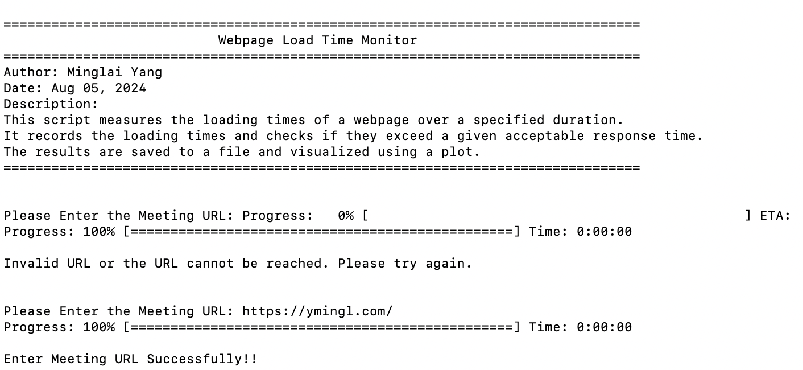
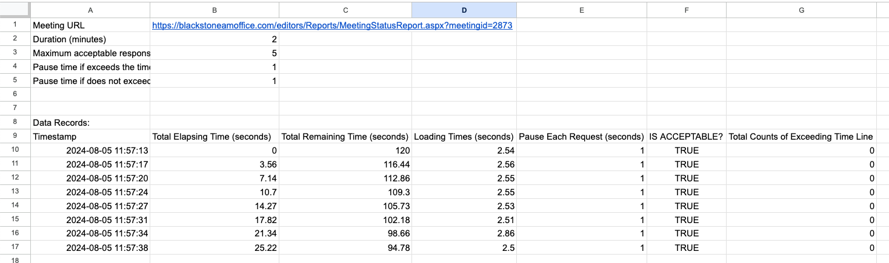
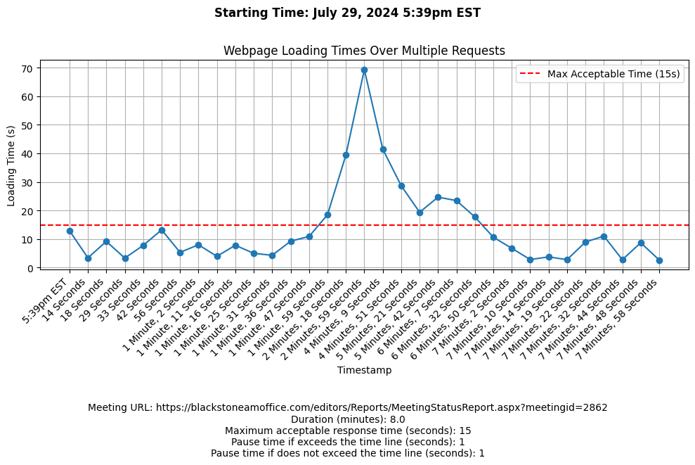
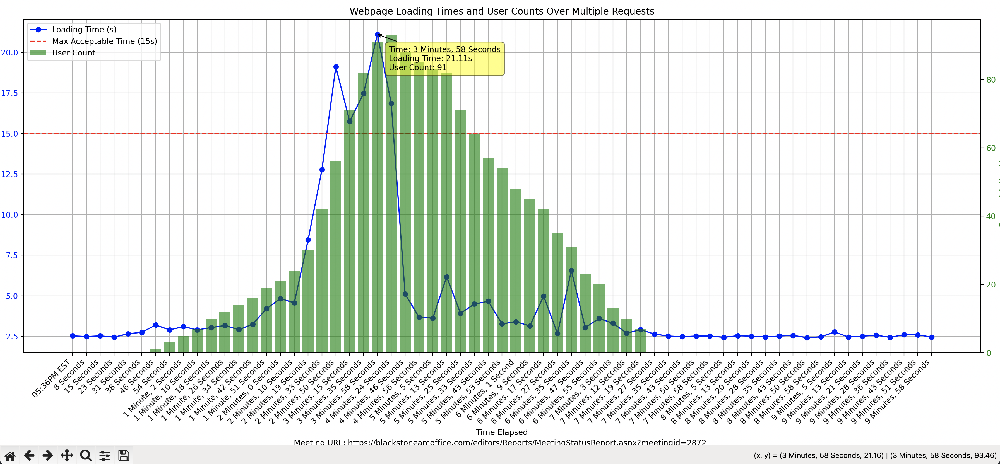

# Webpage Loading Time Monitor

# Project Description: 
This script measures and analyzes the loading times of a specific webpage at regular intervals for a given duration. It utilizes wget to fetch the page, records the loading times, and provides statistics and visualizations to evaluate performance.

### Install `wget` using Homebrew


1. If you don't already have Homebrew installed, you can install it by running the following command in your terminal:
* This command downloads and installs Homebrew on your system.
```bash
/bin/bash -c "$(curl -fsSL https://raw.githubusercontent.com/Homebrew/install/HEAD/install.sh)"
```
# 2. Once Homebrew is installed, you can install `wget` by running:
```bash
brew install wget
```


### Create a Virtual Environment

1. Open your terminal or command prompt.

2. Navigate to your project directory where you want to set up the virtual environment.

3. Create a new virtual environment using Python's built-in venv module:
```bash
python -m venv webpage_tester
```
4. Activate the virtual environment:
* On Windows:
```bash
webpage_tester\Scripts\activate
```
* On macOS and Linux:
```bash
source webpage_tester/bin/activate
```


### Install dependencies
1. Ensure you are in the project directory where the requirements.txt file is located. Install the required packages by running:
```bash 
pip install -r requirements.txt
```

### Run the script
Now, you are ready to run the script. Execute it by running:
```bash 
python wget_test.py
```


These steps set up a separate environment for your project, helping manage dependencies and avoid potential conflicts with other Python projects.

## Please run them in your own terminal, follow the instructions:



## Configuration
You can adjust the following parameters at the start of the script:

* MeetingURL: URL of the webpage to test.
* DURATION_MINUTES: Duration in minutes for which to run the test.
* TIME_LINE: Maximum acceptable response time (seconds).
* PAUSE_TIME_NOT_EXCEED: Sleep time between requests when loading time is acceptable.
* PAUSE_TIME_EXCEED: Sleep time between requests when loading time exceeds the maximum acceptable time.

## Output
A detailed log of each webpage fetch including timestamps, loading times, and whether the loading time was within acceptable limits.
Statistical summary of the webpage's performance.
A plot image file showing the loading times over the session.
Another plot image file showing the loading times with active user counts over the session.

## Documentation for Handling User Activity Data

### Input Format and Data Description:

The active_user_ranges.txt file stores data about user activity in a structured format. Each entry in the file represents a unique user session on a website, detailing when the session began, when it ended, and whether the user successfully reached the final page of their session.

### Data Structure:

Each line in the file represents a single user session and contains the following elements, separated by commas: [User ID, Start Time, End Time, Success Indicator]:

* User ID: A unique identifier for the user.
* Start Time: The timestamp marking the beginning of the user session.
* End Time: The timestamp marking the end of the user session.
* Success Indicator: A boolean value (True or False) indicating whether the user successfully reached the final page during the session.
```
eg. [(11, '2024-08-02 17:42:32', '2024-08-02 17:43:32', False), (24, '2024-08-02 17:43:24', '2024-08-02 17:44:28', False), (1, '2024-08-02 17:41:51', '2024-08-02 17:44:38', True), (2, '2024-08-02 17:41:54', '2024-08-02 17:44:51', True),....]
```
#### You should copy the output from selenium testing script and concatenate every tuple into one list and paste them into `active_user_ranges.txt` file. In this way, you can type `yes` after you copy all the data and return to terminal.

## Example Detailed Log - Copy into Spreadsheet

The data recorded in `data/TIMESTAMP/LoadTimes_WEBSITE-NAME_RUN-TIMEmin.txt` is structured in a tab-separated format, which is ideal for importing into spreadsheet applications such as Microsoft Excel, Google Sheets, or other similar programs. This allows for further analysis and visualization using spreadsheet tools.

```txt
Meeting URL 	 https://blackstoneamoffice.com/editors/Reports/MeetingStatusReport.aspx?meetingid=2873 
Duration (minutes) 	2.0
Maximum acceptable response time (seconds) 	5
Pause time if exceeds the time line (seconds) 	1
Pause time if does not exceed the time line (seconds) 	1


Data Records: 
Timestamp 	Total Elapsing Time (seconds) 	Total Remaining Time (seconds) 	Loading Times (seconds) 	Pause Each Request (seconds) 	IS ACCEPTABLE? 	Total Counts of Exceeding Time Line
2024-08-05 11:57:13 	0.00 	120.00 	 2.54 	 1 	 True	0 
2024-08-05 11:57:17 	3.56 	116.44 	 2.56 	 1 	 True	0 
2024-08-05 11:57:20 	7.14 	112.86 	 2.55 	 1 	 True	0 
2024-08-05 11:57:24 	10.70 	109.30 	 2.55 	 1 	 True	0 
2024-08-05 11:57:27 	14.27 	105.73 	 2.53 	 1 	 True	0 
2024-08-05 11:57:31 	17.82 	102.18 	 2.51 	 1 	 True	0 
2024-08-05 11:57:34 	21.34 	98.66 	 2.86 	 1 	 True	0 
2024-08-05 11:57:38 	25.22 	94.78 	 2.50 	 1 	 True	0 

```
### Steps to Import Data into a Spreadsheet:
1. Open your preferred spreadsheet. I prefer [Google Spreadsheet](https://docs.google.com/spreadsheets/u/0/?pli=1&tgif=d).
2. Create a new spreadsheet and choose the import data option.
3. Copy the txt file from your local directory.
4. Paste that into your spreasheet.
5. Ensure that the data delimiter is set to tab for correct formatting.

Once imported, the data will appear in separate columns, making it easy to perform operations like sorting, filtering, and creating custom charts or graphs.

### Visual Example
For a visual reference on how the data looks when formatted in a spreadsheet, see the image below from `assets/spreadsheet.png`:



This example shows how each column from the text file aligns with the spreadsheet cells, facilitating straightforward analysis of web page loading performance over time.


## Example Plot
* 1. Below is an example plot showing the webpage loading times over the session:


This plot provides a visual representation of the loading times during each interval, helping to measure loadtime with system performance.

* 2. Below is an example plot showing the webpage loading times with active user counts over the session:



This plot provides a visual representation of the loading times alongside the number of active users during each interval, helping to correlate user activity with system performance.

### Additional Features

**Automatic Saving:**
When plots are generated, they are automatically saved to your local directory. This ensures that you have a permanent record of the visual data without needing to manually save each image.

**Interactive Data Visualization:**
When viewing the plot, you can interact with it using your mouse. The plot is equipped with a mouse cursor that allows you to hover over specific data points. When you hover over a point, detailed information about that specific time interval and user count is displayed. This feature is particularly useful for closely examining the effects of user load on webpage performance.


## Contributing
Feel free to fork this repository and submit pull requests with your improvements. You can also open issues for bugs or feature suggestions.

## License
This project is open-sourced under the MIT License. See the LICENSE file for more information.

## Contact
Minglai Yang

Thank you James, Jawad and Susan for your valuable feedback and ideas for this project!