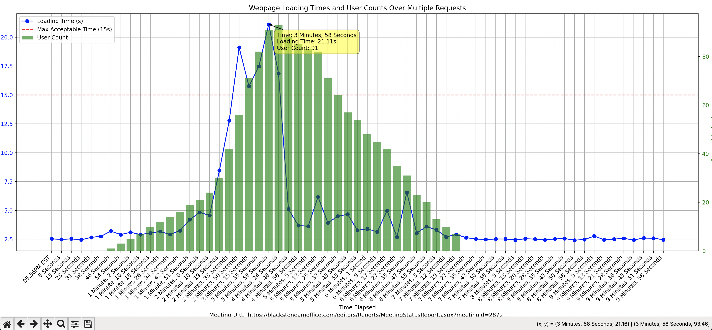

# Project Title
Webpage Loading Time Tester

# Project Description: 
This script measures and analyzes the loading times of a specific webpage at regular intervals for a given duration. It utilizes wget to fetch the page, records the loading times, and provides statistics and visualizations to evaluate performance.

## Setting up the Environment

To run this script, you might want to set up a virtual environment using Conda. Here's how you can do it:

### Install Anaconda or Miniconda

If you haven't already installed Anaconda or Miniconda, download and install it from [Anaconda](https://www.anaconda.com/products/individual) or [Miniconda](https://docs.conda.io/en/latest/miniconda.html).

### Create a Conda Environment


1. Install Anaconda or Miniconda if it is not already installed. You can find Anaconda on the Anaconda website and Miniconda on its documentation page.

2. Open your terminal or command prompt.

3. Create a new Conda environment using a more recent Python version by running the command:
```bash
conda create --name webpage_tester python=3.11
```

1. Activate the new environment by running:
```bash
conda activate webpage_tester
```


### Install dependencies
5.Ensure you are in the project directory where the requirements.txt file is located. Install the required packages by running:
```bash 
pip install -r requirements.txt
```

### Run the script
Now, you are ready to run the script. Execute it by running:
```bash 
python wget_test.py
```


These steps set up a separate environment for your project, helping manage dependencies and avoid potential conflicts with other Python projects.


## Configuration
You can adjust the following parameters at the start of the script:

* MeetingURL: URL of the webpage to test.
* DURATION_MINUTES: Duration in minutes for which to run the test.
* TIME_LINE: Maximum acceptable response time (seconds).
* PAUSE_TIME_NOT_EXCEED: Sleep time between requests when loading time is acceptable.
* PAUSE_TIME_EXCEED: Sleep time between requests when loading time exceeds the maximum acceptable time.

## Output
A detailed log of each webpage fetch including timestamps, loading times, and whether the loading time was within acceptable limits.
Statistical summary of the webpage's performance.
A plot image file showing the loading times over the session.
Another plot image file showing the loading times with active user counts over the session.

## Documentation for Handling User Activity Data

### File Format and Data Description:

The active_user_ranges.txt file stores data about user activity in a structured format. Each entry in the file represents a unique user session on a website, detailing when the session began, when it ended, and whether the user successfully reached the final page of their session.

### Data Structure:

Each line in the file represents a single user session and contains the following elements, separated by commas: [User ID, Start Time, End Time, Success Indicator]:

* User ID: A unique identifier for the user.
* Start Time: The timestamp marking the beginning of the user session.
* End Time: The timestamp marking the end of the user session.
* Success Indicator: A boolean value (True or False) indicating whether the user successfully reached the final page during the session.
```
eg. [(11, '2024-08-02 17:42:32', '2024-08-02 17:43:32', False), (24, '2024-08-02 17:43:24', '2024-08-02 17:44:28', False), (1, '2024-08-02 17:41:51', '2024-08-02 17:44:38', True), (2, '2024-08-02 17:41:54', '2024-08-02 17:44:51', True),....]
```
#### You should copy the output from selenium testing script and concatenate every tuple into one list and paste them into `active_user_ranges.txt` file. In this way, you can type `yes` after you copy all the data and return to terminal.


## Example Plot

Below is an example plot showing the webpage loading times with active user counts over the session:



This plot provides a visual representation of the loading times alongside the number of active users during each interval, helping to correlate user activity with system performance.

### Additional Features

**Automatic Saving:**
When plots are generated, they are automatically saved to your local directory. This ensures that you have a permanent record of the visual data without needing to manually save each image.

**Interactive Data Visualization:**
When viewing the plot, you can interact with it using your mouse. The plot is equipped with a mouse cursor that allows you to hover over specific data points. When you hover over a point, detailed information about that specific time interval and user count is displayed. This feature is particularly useful for closely examining the effects of user load on webpage performance.


## Contributing
Feel free to fork this repository and submit pull requests with your improvements. You can also open issues for bugs or feature suggestions.

## License
This project is open-sourced under the MIT License. See the LICENSE file for more information.

## Contact
[Minglai Yang](ymingl.com)
